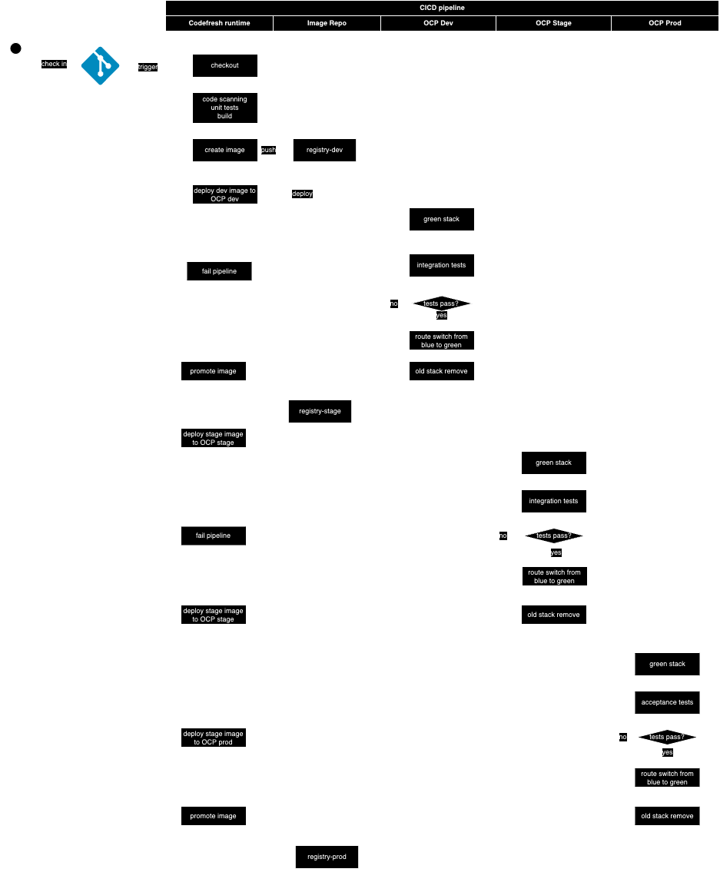

## Runner
- Using [helm](https://artifacthub.io/packages/helm/codefresh-runner/cf-runtime#openshift)
```
oc adm policy add-scc-to-user privileged system:serviceaccount:codefresh:cf-runtime-runner

oc adm policy add-scc-to-user privileged system:serviceaccount:codefresh:cf-runtime-volume-provisioner
```
- To create K8s cluster integration from codefresh using load-balancer for API:
    - Need CA for load-balancer: https://codefresh.io/docs/docs/kb/articles/verify-cluster-tls-ssl-configuration/

## Pipelines
- Create [Runner](#runner)
- Create cluster
- Create project
```
$ codefresh create project ioc
$ codefresh create pipeline -f pipelines/create-base-image.yml
```
### Pipeline details
 
## References
- https://codefresh.io/docs/docs/integrations/codefresh-api/
- https://codefresh.io/blog/ci-cd-pipelines-microservices/
## Troubleshooting
To debug directly a step in container:
- use command `sleep infinity`
- On K8s cluster, go to `dind` container, run `docker exec -it <container_id_or_name> /bin/bash` 
